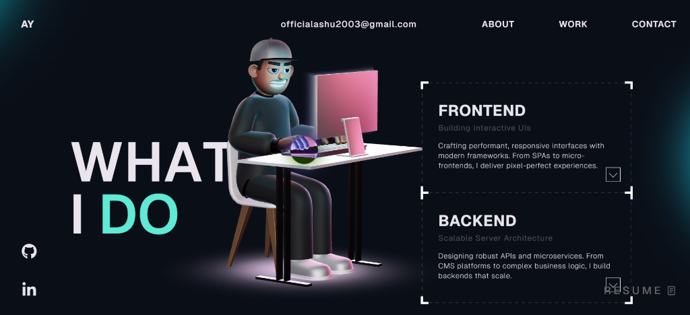

# My Portfolio Website - Overview 🚀

Welcome to my professional portfolio! This repository contains the open-source version of my portfolio, designed with high-end aesthetics and smooth user experiences.

  

## Tech Stack 🛠️

- **Frontend**: React, TypeScript, GSAP
- **Graphics**: ThreeJS, WebGL
- **Styling**: Vanilla CSS, HTML5

## Instructions 🔧

I have modified the GSAP plugins to use the trial versions for demonstration purposes. Note that the trial plugins cannot be used for production hosting 🔴. For official GSAP Club plugins, check out [GSAP Installation](https://gsap.com/docs/v3/Installation/).

## License

This project is open-source and available under the [MIT License](LICENSE).
